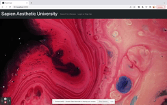

# SapienAestheticUniversity

## Descroption 

We made this website because we wanted intrduce the Sapien Skin University. User can use this websit to undstand the Sapien Skin University better and grt the information they want. Sapien Skin University is an online platform for trusted industry skin care professionals to sell educational courses. The courses can be videos, audio, quizzes, or articles. 

## Homepage Image:
The following animation demonstrates the application functionality:

## User Story 
As a user I want search for what I need and get the right information at the first moment. 

* 'WHEN' the user goes the homepage
* 'THEN' user can SEARCH for class wich they are looking for and LOGIN or SIGN Up to they own account

* 'WHEN' user scrop down 
* 'THEN' user can see different subject

* 'WHEN' user click 'Add to curriculum'
* 'THEN' user can have it on their account

## Process

## Future Development
* for user who has regist account with SAU they can have their own public web page to share their experience.
* the other user think their exprience is helphul for them, they can give 👍 

## Installation Dependencies:
* npm
* reaction

## Links to deployed site and Github
* [Deployed Heroku site]
* [Git Repository](https://github.com/ManuelaKenna/SapienAestheticUniversity)

- sxzzGoogle Doc: https://docs.google.com/document/d/1_f6o84mI9TEDfKhepSmC1BKwlND1EqgElITPeeYrtr8/edit#

app

## Authors
* Manuela Kenna 
* Zeinab Hared
* Rong Xu
* Scott Gauthier
* Kristin Lynch 
* Henry He
